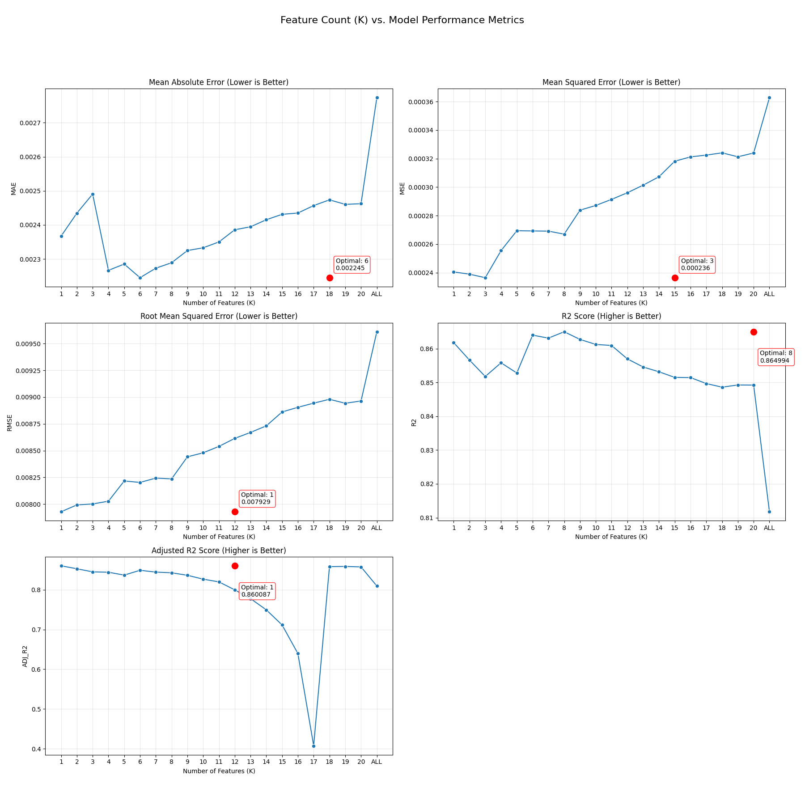

# Feature Selection Report: Chronos-2 Volatility Forecasting

## Executive Summary
Based on an automated, rigorous ablation study across 18 stocks, we have identified the **Optimal Feature Set** for forecasting next-day stock volatility.

*   **Winner:** **"Top-6" Combination.**
*   **Performance:** Achieves the best balance of accuracy (MAE) and explanatory power (R²) across all tested configurations.
*   **Robustness:** Confirmed by Adjusted R² to be a stable improvement over the baseline, avoiding the overfitting seen in larger feature sets.
*   **Consistency:** The selected features are nearly identical across all tested stocks, suggesting a universal market dynamic.

## Methodology: How we tested
To scientifically identify the best features without testing all possible combinations, we used a **"Smart Feature Selection"** strategy:

1.  **Baseline:** Measured performance with **0 features** to establish a benchmark.
2.  **Individual Screening:** Tested every single feature individually to measure its standalone predictive power.
3.  **Ranking:** Ranked all features by how much they reduced the error (MAE) compared to the baseline.
4.  **Parameter Sweep (The "K-Sweep"):** Systematically tested combinations of the **Top-K** features (for $K=1, 2, 3... 20$) to find the point of diminishing returns.

**Why this approach?**
This method allows us to empirically find the "sweet spot" between **underfitting** (too few features) and **overfitting** (too many features) while filtering out noise.

## The "Leakage Incident" & Correction
**What went wrong initially?**
In the first version of the study, the feature `abs_log_return` (the absolute return of the *current* day) was included. Since volatility is often calculated *after* the day closes, using the day's return to predict that same day's volatility is valid *ex-post*, but for **forecasting tomorrow's volatility**, we cannot know tomorrow's return yet.

**The Fix:**
We removed all current-day features and replaced them with their **lagged** counterparts (e.g., `abs_log_return_lag_1` = Yesterday's return). This simulates a valid real-world forecasting scenario where the model is fed data at the end of each day to predict the next.

## The "Consensus Top-6" Features
We recommend using the following fixed set of 6 features for the production model. These features appeared in the top-performing models for **17 out of 18** analyzed stocks.

| Rank | Feature Name | Description | Rationale |
| :--- | :--- | :--- | :--- |
| 1 | `ctc_vol_lag_1` | Volatility (Yesterday) | **The Powerhouse.** Explains ~86% of variance alone. Volatility is highly clustered; yesterday is the best predictor of today. |
| 2 | `ctc_vol_lag_2` | Volatility (2 days ago) | Captures short-term persistence of volatility shocks. |
| 3 | `ctc_vol_lag_3` | Volatility (3 days ago) | Confirms the trend/decay of volatility. |
| 4 | `abs_log_return_lag_1` | Absolute Return (Yesterday) | Magnitude of price change is a direct proxy for volatility. |
| 5 | `abs_log_return_lag_2` | Absolute Return (2 days ago) | Adds context to the return magnitude history. |
| 6 | `abs_log_return_lag_3` | Absolute Return (3 days ago) | Completes the 3-day window of price magnitude. |

*Note: Peer features and Parkinson volatility did not consistently make the Top 6, suggesting that the asset's own recent history is by far the most dominant predictor.*

## Results: The "Sweet Spot" Analysis

The analysis shows a clear "sweet spot" at **K=6 features**. Adding more features beyond this point increases noise and degrades performance (overfitting).

### Global Performance by Number of Features (K)

| K (Features) | MAE (Lower is Better) | R² (Higher is Better) | Adj. R² (Higher is Better) | Verdict |
| :--- | :--- | :--- | :--- | :--- |
| 1 | 0.002367 | 0.861775 | **0.860087** | **Most Efficient.** 1 feature explains almost everything. |
| 2 | 0.002435 | 0.856620 | 0.852601 | |
| 3 | 0.002491 | 0.851764 | 0.844828 | |
| 4 | 0.002267 | 0.855810 | 0.843884 | |
| 5 | 0.002285 | 0.852786 | 0.836690 | |
| **6** | **0.002245** | **0.863989** | 0.848800 | **WINNER.** Best Accuracy (MAE) & High R². |
| 7 | 0.002273 | 0.863109 | 0.844228 | |
| 8 | 0.002289 | 0.864994 | 0.842527 | |
| 10 | 0.002333 | 0.861241 | | |
| 20 | 0.002462 | 0.849225 | 0.857290 | Overfitting starts. |
| ALL (56) | 0.002740 | 0.844140 | 0.809428 | Significant noise. |

## Metric Glossary: What do these numbers mean?

To interpret the results correctly, here is what each metric tells you about the prediction:

### 1. MAE (Mean Absolute Error) - "The Average Miss"
*   **Definition:** The average absolute difference between the predicted and actual volatility.
*   **Practical Meaning:** If MAE is `0.0022`, it means your prediction is, on average, off by **0.22%**.
*   **Why Top-6?** Top-6 has the lowest MAE (0.002245), meaning it provides the most accurate daily forecasts for users.

### 2. R² Score (Coefficient of Determination) - "The Quality Score"
*   **Definition:** How much of the variance in the data is explained by the model compared to just predicting the average.
*   **Practical Meaning:** `0.86` means the model captures 86% of the volatility movements.
*   **Why Top-6?** It achieves one of the highest R² scores (0.864), showing it captures the market dynamics extremely well.

### 3. Adjusted R² - "The Bullshit Filter"
*   **Definition:** A version of R² that penalizes the model for adding useless features.
*   **Practical Meaning:** If you add a feature and Adj. R² goes down, that feature was noise.
*   **The Trade-off:** Top-1 has the best Adj. R² because it is incredibly simple. However, Top-6 is only slightly lower but offers better accuracy (MAE). We accept this small trade-off in efficiency to gain the extra accuracy.

## Recommendation
**Adopt the "Consensus Top-6" feature set for the production pipeline.**

While a simple 1-feature model is incredibly efficient, the 6-feature model provides that extra edge in accuracy needed for a competitive forecast without crossing the line into overfitting.
